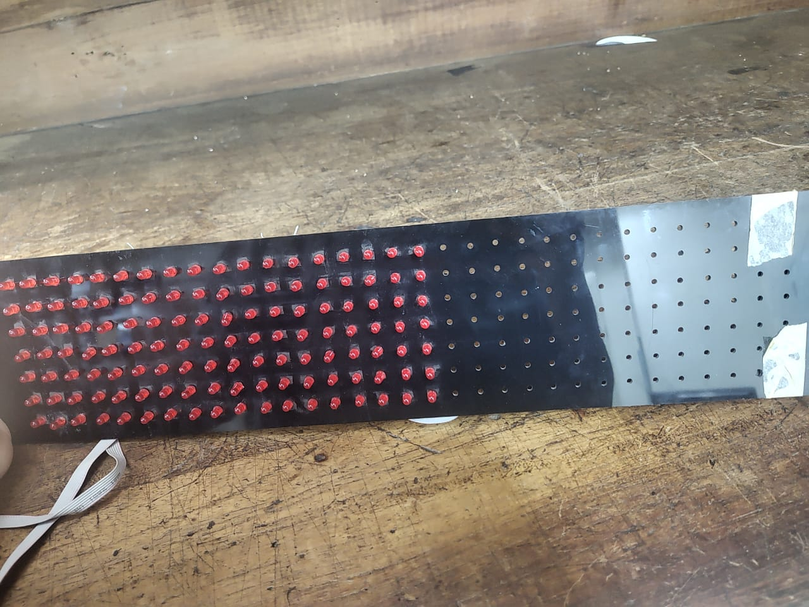

# ModuLED
Matriz led con doble función, Reloj Digital + Stacker Blocks

Es una Matriz de 18x7 que encontré en el LABI. 
La idea es que tenga 2 funciones
Por un lado que sea un reloj digital para que quede en el LABI (a falta del reloj) 
Por otro lado quiero que tenga una función de "Game" para utilizar en los eventos del CDR (Como la feria del Libro o la Noche de los Museos). Este juego sería el stacker blocks
-> Dejo videos de referencia

Para controlarlo decidí usar un modulo que controla matrices 8x8. Para cubrir todo el panel compré 3 modulos MAX7219 
Se va a programar con Arduino 
Objetivo: Una vez que funcione con Arduino la idea es programarlo con un ATMega del club (para esto hay que aprender a programar microcontroladores) 

