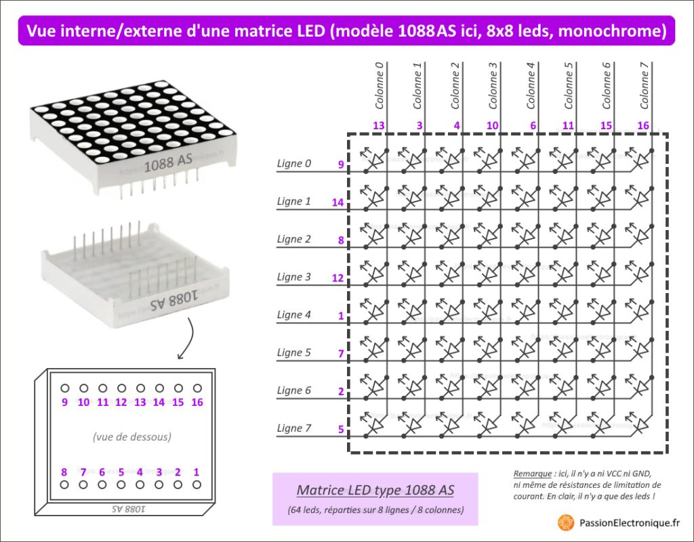

El modulo MAX7219 viene con un display 8x8 para usar. 
El objetivo es poder hacer esa matriz 8x8 (En realidad 8x7) pero con el panel que ya tenemos 

Links de referencias para como utilizar el modulo MAX7219 

https://passionelectronique.fr/matrice-led-max7219-arduino/

https://www.pcbway.com/project/shareproject/LED_Dot_Matrix_MAX7219_1a67794a.html

https://www.14core.com/how-to-wire-8x8-matrix-led-with-max7219-on-arduino/

https://components101.com/displays/max7219-8x8-led-matrix-module